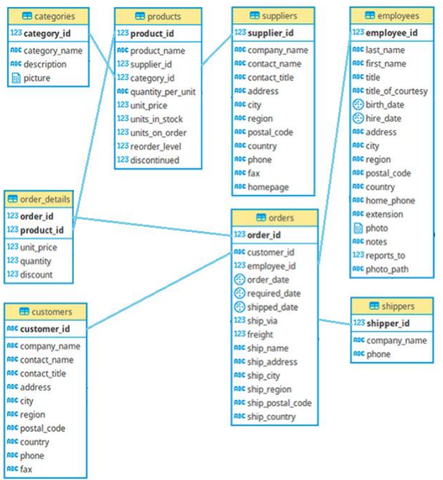

# PrimeiroProjeto - Google BigQuery

>Resolução de problemas de negócio simulados e soluções de requisições utilizando Google BigQuery e BD Relacional, mas podendo ser ultilizado Datawarehouse AWS Redshift e AWS S3.

## Objetivo: 

O presente projeto tem como objetivo simular requisições e problemas de negócios de uma empresa fictícia com um banco de dados (organização fictícia que gerencia pedidos, produtos, clientes, fornecedores, colaboradores, etc). 

O esquema do BD Relacional da empresa se dá de acordo com a imagem:

## Preparação do ambiente

Para realizar as atividades propostas, o curso utilizou-se da seguinte estrutura:
 
* Criação de Cluster Redshift;
* Criação da estrutura do Datawarehouse Northwind;
* Upload dos arquivos .csv do PC Local para um bucket no AWS S3;
* Cópia dos dados do AWS S3 para o datawarehouse no Redshift;
* Resolução das atividades que simulam problemas de negócios e exportação de csv.

> No meu caso por preferir ultilizar o BigQuery, que não ofereceria custos extras,
> tive os seguintes passos:
> P.s.: Na carga das tabalas, o nome das colunas perderam o underline '_'
 
 * Upload dos arquivos no Google Cloud Storage;
 * Criação do Dataset dentro do Google BigQuery;
 * Copia das tabelas para o dataset, ultilizando 'detectar automaticamente Esquemas', nas opções avançadas mudar o delimiter para ';' e marcar 'ignorar a primeira linha';
 * Após a carga de todas as tabelas estamos prontos para resolução de problemas;
